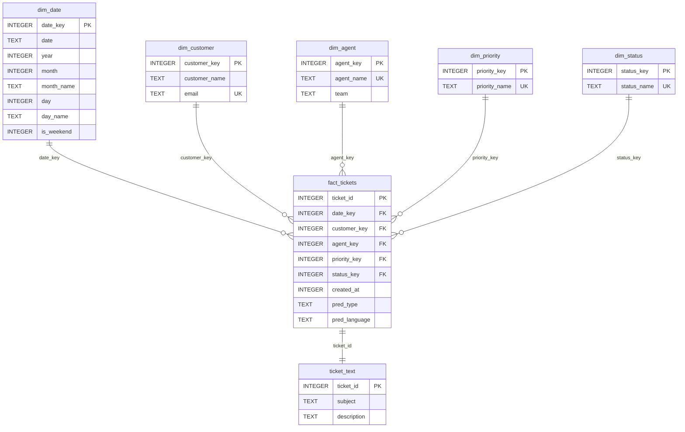

# Esquema Snowflake BASIC

Referencia del esquema **BASIC** que genera actualmente `src/services/dw_service.py`.

Este nivel esta pensado para datasets simples de tickets. Mantiene las dimensiones esenciales y guarda las predicciones ML principales (`pred_type`, `pred_language`) directamente en la tabla de hechos para reducir tablas y tamaño.

---

## Cuando se Genera

`DWService` elige BASIC cuando el dataset no contiene columnas que obliguen a un nivel superior:

- No hay `ticket_type`.
- No hay `language`, `lang` o `idioma` explicitos.
- No hay `queue`, `answer`, `version`, `tags` ni columnas `tag_*`.

Aunque `MLService` añade `pred_type`, `pred_language` y `pred_level`, esas columnas de prediccion no fuerzan MEDIUM ni PRO. BASIC puede almacenarlas en `fact_tickets`.

---

## Diagrama



---

## Tablas

| Tabla | Rol | Comentario |
| --- | --- | --- |
| `dim_date` | Dimension temporal | Fechas en clave `YYYYMMDD` y atributos basicos |
| `dim_customer` | Dimension cliente | Nombre y email normalizados |
| `dim_agent` | Dimension agente | Agente asignado y equipo sintetico si falta |
| `dim_priority` | Dimension prioridad | Prioridades deduplicadas |
| `dim_status` | Dimension estado | Estados deduplicados |
| `fact_tickets` | Hechos | Ticket central con claves de dimension y predicciones |
| `ticket_text` | Texto | Subject y description separados del hecho |

---

## DDL Real

```sql
CREATE TABLE IF NOT EXISTS dim_date (
    date_key INTEGER PRIMARY KEY,
    date TEXT,
    year INTEGER,
    month INTEGER,
    month_name TEXT,
    day INTEGER,
    day_name TEXT,
    is_weekend INTEGER
);

CREATE TABLE IF NOT EXISTS dim_customer (
    customer_key INTEGER PRIMARY KEY AUTOINCREMENT,
    customer_name TEXT,
    email TEXT UNIQUE
);

CREATE TABLE IF NOT EXISTS dim_agent (
    agent_key INTEGER PRIMARY KEY AUTOINCREMENT,
    agent_name TEXT UNIQUE,
    team TEXT
);

CREATE TABLE IF NOT EXISTS dim_priority (
    priority_key INTEGER PRIMARY KEY AUTOINCREMENT,
    priority_name TEXT UNIQUE
);

CREATE TABLE IF NOT EXISTS dim_status (
    status_key INTEGER PRIMARY KEY AUTOINCREMENT,
    status_name TEXT UNIQUE
);

CREATE TABLE IF NOT EXISTS fact_tickets (
    ticket_id INTEGER PRIMARY KEY AUTOINCREMENT,
    date_key INTEGER,
    customer_key INTEGER,
    agent_key INTEGER,
    priority_key INTEGER,
    status_key INTEGER,
    created_at INTEGER,
    pred_type TEXT,
    pred_language TEXT
);

CREATE TABLE IF NOT EXISTS ticket_text (
    ticket_id INTEGER PRIMARY KEY,
    subject TEXT,
    description TEXT
);
```

---

## Insercion de Datos

Durante la carga:

- Si falta `created_at`, se generan fechas sinteticas repartidas en los ultimos 180 dias.
- Si falta cliente, se generan `customerN@mail.com` y `Customer N`.
- Si falta agente, se asigna un agente sintetico desde un pool interno.
- Si falta estado, se distribuye entre estados realistas.
- `subject` se trunca a 200 caracteres.
- `description` se trunca a 1.000 caracteres.
- `pred_type` y `pred_language` proceden de `MLService`.

Durante ingest externa:

- Se inserta en el mismo esquema BASIC.
- La API genera un `subject` corto si solo llega cuerpo.
- El idioma se verifica por texto antes de persistirse.
- El tipo se normaliza al catalogo de negocio cuando hay señales suficientes.

---

## Consultas Utiles

Tickets por prioridad:

```sql
SELECT p.priority_name, COUNT(*) AS total
FROM fact_tickets f
JOIN dim_priority p ON p.priority_key = f.priority_key
GROUP BY p.priority_name
ORDER BY total DESC;
```

Tickets abiertos:

```sql
SELECT f.ticket_id, tt.subject, p.priority_name, s.status_name, f.pred_type
FROM fact_tickets f
JOIN ticket_text tt ON tt.ticket_id = f.ticket_id
JOIN dim_priority p ON p.priority_key = f.priority_key
JOIN dim_status s ON s.status_key = f.status_key
WHERE s.status_name = 'open'
ORDER BY f.created_at DESC;
```

Distribucion de tipos predichos:

```sql
SELECT pred_type, COUNT(*) AS total
FROM fact_tickets
GROUP BY pred_type
ORDER BY total DESC;
```

Evolucion mensual:

```sql
SELECT d.year, d.month, COUNT(*) AS total
FROM fact_tickets f
JOIN dim_date d ON d.date_key = f.date_key
GROUP BY d.year, d.month
ORDER BY d.year, d.month;
```

---

## Limitaciones del Nivel

- No tiene `dim_language`: el idioma queda como texto en `fact_tickets.pred_language`.
- No tiene `dim_type`: el tipo queda como texto en `fact_tickets.pred_type`.
- No conserva `queue`, `answer`, `version` ni tags.
- Si una base necesita esos campos, debe generarse o actualizarse a MEDIUM/PRO.
