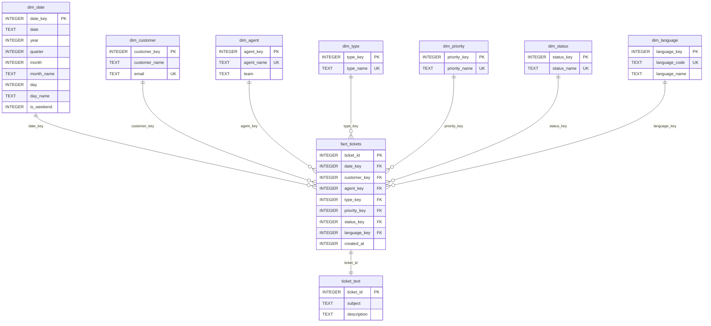

# Esquema Snowflake MEDIUM

Referencia del esquema **MEDIUM** que genera actualmente `src/services/dw_service.py`.

MEDIUM mantiene el modelo compacto de BASIC, pero normaliza el tipo de ticket y el idioma en dimensiones propias. Es el nivel adecuado cuando el dataset ya trae informacion explicita de clasificacion o idioma y se quiere consultar esos atributos como dimensiones.

---

## Cuando se Genera

`DWService` elige MEDIUM cuando el dataset contiene al menos una de estas columnas y no contiene campos que obliguen a PRO:

- `ticket_type`
- `language`
- `lang`
- `idioma`

Campos que suben directamente a PRO:

- `queue`
- `answer`
- `version`
- `tags`
- Cualquier columna con prefijo `tag_`

---

## Diagrama



---

## Tablas

| Tabla | Rol | Comentario |
| --- | --- | --- |
| `dim_date` | Dimension temporal | Añade `quarter` respecto a BASIC |
| `dim_customer` | Dimension cliente | Nombre y email |
| `dim_agent` | Dimension agente | Agente asignado y equipo |
| `dim_type` | Dimension tipo | Tipo predicho o recibido |
| `dim_priority` | Dimension prioridad | Prioridades deduplicadas |
| `dim_status` | Dimension estado | Estados deduplicados |
| `dim_language` | Dimension idioma | Codigo ISO y nombre |
| `fact_tickets` | Hechos | Ticket central con FKs normalizadas |
| `ticket_text` | Texto | Subject y description |

---

## DDL Real

```sql
CREATE TABLE IF NOT EXISTS dim_date (
    date_key INTEGER PRIMARY KEY,
    date TEXT,
    year INTEGER,
    quarter INTEGER,
    month INTEGER,
    month_name TEXT,
    day INTEGER,
    day_name TEXT,
    is_weekend INTEGER
);

CREATE TABLE IF NOT EXISTS dim_customer (
    customer_key INTEGER PRIMARY KEY AUTOINCREMENT,
    customer_name TEXT,
    email TEXT UNIQUE
);

CREATE TABLE IF NOT EXISTS dim_agent (
    agent_key INTEGER PRIMARY KEY AUTOINCREMENT,
    agent_name TEXT UNIQUE,
    team TEXT
);

CREATE TABLE IF NOT EXISTS dim_type (
    type_key INTEGER PRIMARY KEY AUTOINCREMENT,
    type_name TEXT UNIQUE
);

CREATE TABLE IF NOT EXISTS dim_priority (
    priority_key INTEGER PRIMARY KEY AUTOINCREMENT,
    priority_name TEXT UNIQUE
);

CREATE TABLE IF NOT EXISTS dim_status (
    status_key INTEGER PRIMARY KEY AUTOINCREMENT,
    status_name TEXT UNIQUE
);

CREATE TABLE IF NOT EXISTS dim_language (
    language_key INTEGER PRIMARY KEY AUTOINCREMENT,
    language_code TEXT UNIQUE,
    language_name TEXT
);

CREATE TABLE IF NOT EXISTS fact_tickets (
    ticket_id INTEGER PRIMARY KEY AUTOINCREMENT,
    date_key INTEGER,
    customer_key INTEGER,
    agent_key INTEGER,
    type_key INTEGER,
    priority_key INTEGER,
    status_key INTEGER,
    language_key INTEGER,
    created_at INTEGER
);

CREATE TABLE IF NOT EXISTS ticket_text (
    ticket_id INTEGER PRIMARY KEY,
    subject TEXT,
    description TEXT
);
```

---

## Insercion de Datos

Durante la carga:

- `pred_type` se inserta o reutiliza en `dim_type`.
- `pred_language` se normaliza a codigo soportado (`en`, `es`, `de`, `fr`, `pt`) y se inserta en `dim_language`.
- Si faltan cliente, agente, fecha o estado, se generan valores sinteticos igual que en BASIC.
- `subject` se trunca a 200 caracteres.
- `description` se trunca a 1.000 caracteres.

Durante ingest externa:

- El nivel de la base existente determina la ruta de insercion.
- En MEDIUM se rellenan `dim_type` y `dim_language` antes de insertar en `fact_tickets`.
- Si el payload no trae `queue`, no se almacena porque MEDIUM no tiene `dim_queue`.

---

## Consultas Utiles

Tickets por tipo:

```sql
SELECT t.type_name, COUNT(*) AS total
FROM fact_tickets f
JOIN dim_type t ON t.type_key = f.type_key
GROUP BY t.type_name
ORDER BY total DESC;
```

Tickets por idioma:

```sql
SELECT l.language_code, l.language_name, COUNT(*) AS total
FROM fact_tickets f
JOIN dim_language l ON l.language_key = f.language_key
GROUP BY l.language_code, l.language_name
ORDER BY total DESC;
```

Prioridad por idioma:

```sql
SELECT l.language_code, p.priority_name, COUNT(*) AS total
FROM fact_tickets f
JOIN dim_language l ON l.language_key = f.language_key
JOIN dim_priority p ON p.priority_key = f.priority_key
GROUP BY l.language_code, p.priority_name
ORDER BY l.language_code, total DESC;
```

Tickets abiertos con texto:

```sql
SELECT f.ticket_id, tt.subject, t.type_name, l.language_code, s.status_name
FROM fact_tickets f
JOIN ticket_text tt ON tt.ticket_id = f.ticket_id
JOIN dim_type t ON t.type_key = f.type_key
JOIN dim_language l ON l.language_key = f.language_key
JOIN dim_status s ON s.status_key = f.status_key
WHERE s.status_name = 'open'
ORDER BY f.created_at DESC;
```

---

## Diferencias con BASIC

| Aspecto | BASIC | MEDIUM |
| --- | --- | --- |
| Tipo de ticket | `fact_tickets.pred_type` | `dim_type` + `type_key` |
| Idioma | `fact_tickets.pred_language` | `dim_language` + `language_key` |
| Tiempo | Sin `quarter` | Con `quarter` |
| Tamaño | Menor | Algo mayor por dimensiones extra |
| Analitica | Suficiente para volumen simple | Mejor para segmentar por tipo/idioma |

---

## Limitaciones del Nivel

- No conserva `queue`.
- No conserva `answer`.
- No conserva tags ni relaciones many-to-many.
- No guarda contadores de palabras.
- Si esos campos aparecen en el dataset, el sistema genera PRO.
