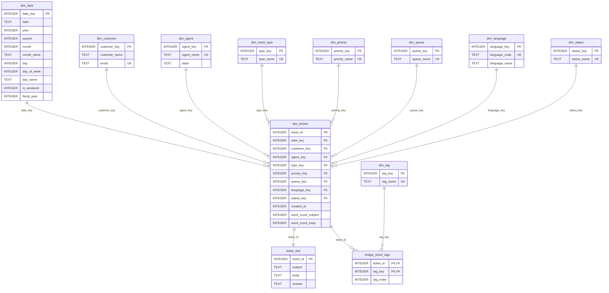

# Esquema Snowflake PRO

Referencia del esquema **PRO** que genera actualmente `src/services/dw_service.py`.

PRO es el nivel mas completo. Esta diseñado para datasets que traen colas, respuestas o tags, y por tanto necesitan mas dimensiones y una relacion many-to-many entre tickets y etiquetas.

---

## Cuando se Genera

`DWService` elige PRO cuando el dataset contiene cualquiera de estos campos:

- `queue`
- `answer`
- `version` como señal de dataset avanzado
- `tags`
- Cualquier columna con prefijo `tag_`

PRO tambien puede crearse desde el portal mediante upgrade desde BASIC o MEDIUM. En ese caso se extraen los tickets existentes, se reclasifican con los modelos actuales y se reconstruye la base validando que el numero de tickets se conserva.

Nota: `version` fuerza PRO en la seleccion actual, pero no existe una columna `version` en el esquema persistido.

---

## Diagrama



---

## Tablas

| Tabla | Rol | Comentario |
| --- | --- | --- |
| `dim_date` | Dimension temporal | Incluye quarter, dia de semana y fiscal year |
| `dim_customer` | Dimension cliente | Nombre y email |
| `dim_agent` | Dimension agente | Agente asignado y equipo |
| `dim_ticket_type` | Dimension tipo | Tipo predicho o recibido |
| `dim_priority` | Dimension prioridad | Prioridades deduplicadas |
| `dim_queue` | Dimension cola | Cola/departamento/categoria operativa |
| `dim_language` | Dimension idioma | Codigo ISO y nombre |
| `dim_status` | Dimension estado | Estados deduplicados |
| `dim_tag` | Dimension tag | Catalogo de etiquetas |
| `fact_tickets` | Hechos | Ticket central con FKs y metricas de texto |
| `bridge_ticket_tags` | Puente | Relacion many-to-many ticket-tag |
| `ticket_text` | Texto | Subject, body y answer |

---

## DDL Real

```sql
CREATE TABLE IF NOT EXISTS dim_date (
    date_key INTEGER PRIMARY KEY,
    date TEXT,
    year INTEGER,
    quarter INTEGER,
    month INTEGER,
    month_name TEXT,
    day INTEGER,
    day_of_week INTEGER,
    day_name TEXT,
    is_weekend INTEGER,
    fiscal_year INTEGER
);

CREATE TABLE IF NOT EXISTS dim_customer (
    customer_key INTEGER PRIMARY KEY AUTOINCREMENT,
    customer_name TEXT,
    email TEXT UNIQUE
);

CREATE TABLE IF NOT EXISTS dim_agent (
    agent_key INTEGER PRIMARY KEY AUTOINCREMENT,
    agent_name TEXT UNIQUE,
    team TEXT
);

CREATE TABLE IF NOT EXISTS dim_ticket_type (
    type_key INTEGER PRIMARY KEY AUTOINCREMENT,
    type_name TEXT UNIQUE
);

CREATE TABLE IF NOT EXISTS dim_priority (
    priority_key INTEGER PRIMARY KEY AUTOINCREMENT,
    priority_name TEXT UNIQUE
);

CREATE TABLE IF NOT EXISTS dim_queue (
    queue_key INTEGER PRIMARY KEY AUTOINCREMENT,
    queue_name TEXT UNIQUE
);

CREATE TABLE IF NOT EXISTS dim_language (
    language_key INTEGER PRIMARY KEY AUTOINCREMENT,
    language_code TEXT UNIQUE,
    language_name TEXT
);

CREATE TABLE IF NOT EXISTS dim_status (
    status_key INTEGER PRIMARY KEY AUTOINCREMENT,
    status_name TEXT UNIQUE
);

CREATE TABLE IF NOT EXISTS dim_tag (
    tag_key INTEGER PRIMARY KEY AUTOINCREMENT,
    tag_name TEXT UNIQUE
);

CREATE TABLE IF NOT EXISTS fact_tickets (
    ticket_id INTEGER PRIMARY KEY AUTOINCREMENT,
    date_key INTEGER,
    customer_key INTEGER,
    agent_key INTEGER,
    type_key INTEGER,
    priority_key INTEGER,
    queue_key INTEGER,
    language_key INTEGER,
    status_key INTEGER,
    created_at INTEGER,
    word_count_subject INTEGER,
    word_count_body INTEGER
);

CREATE TABLE IF NOT EXISTS bridge_ticket_tags (
    ticket_id INTEGER,
    tag_key INTEGER,
    tag_order INTEGER,
    PRIMARY KEY (ticket_id, tag_key)
) WITHOUT ROWID;

CREATE TABLE IF NOT EXISTS ticket_text (
    ticket_id INTEGER PRIMARY KEY,
    subject TEXT,
    body TEXT,
    answer TEXT
);
```

---

## Insercion de Datos

Durante la carga:

- `pred_type` se inserta en `dim_ticket_type`.
- `pred_language` se normaliza e inserta en `dim_language`.
- `queue` se inserta en `dim_queue`; si falta en ingest, se infiere desde el tipo.
- `priority` y `status` se deduplican en sus dimensiones.
- `word_count_subject` y `word_count_body` se calculan desde el texto persistido.
- `answer` se conserva en `ticket_text.answer`.
- `version`, si llega en el dataset, no se persiste en el esquema actual.
- `subject` se trunca a 200 caracteres.
- `body` se trunca a 1.000 caracteres.
- `answer` se trunca a 500 caracteres.

Formato de tags soportado:

- Columna unica `tags` con valores separados por coma: `Bug, Feature, Crash`.
- Columnas booleanas `tag_*`, por ejemplo `tag_bug = true`, `tag_security = 1`.

Los tags se insertan en `dim_tag` y se relacionan con `fact_tickets` mediante `bridge_ticket_tags`.

---

## Ingest Externa en PRO

Cuando se inserta un ticket por:

```text
POST /api/v1/ingest/<file_id>/<api_key>/tickets
```

la API:

- Normaliza `subject` y `body`.
- Clasifica tipo e idioma.
- Normaliza el tipo al catalogo de negocio.
- Infere `queue` si no llega en el payload.
- Inserta `dim_ticket_type`, `dim_language`, `dim_queue`, `dim_priority`, `dim_status`, `dim_customer`, `dim_agent` y `dim_date`.
- Inserta tags si el payload trae columnas `tag_*`.
- Reescribe la base comprimida con zlib (`ZLDB`) para reducir latencia.
- Cifra y sobreescribe el blob asociado al archivo.

---

## Consultas Utiles

Tickets por cola:

```sql
SELECT q.queue_name, COUNT(*) AS total
FROM fact_tickets f
JOIN dim_queue q ON q.queue_key = f.queue_key
GROUP BY q.queue_name
ORDER BY total DESC;
```

Tipos por idioma:

```sql
SELECT l.language_code, t.type_name, COUNT(*) AS total
FROM fact_tickets f
JOIN dim_language l ON l.language_key = f.language_key
JOIN dim_ticket_type t ON t.type_key = f.type_key
GROUP BY l.language_code, t.type_name
ORDER BY l.language_code, total DESC;
```

Tags mas frecuentes:

```sql
SELECT tg.tag_name, COUNT(*) AS total
FROM bridge_ticket_tags b
JOIN dim_tag tg ON tg.tag_key = b.tag_key
GROUP BY tg.tag_name
ORDER BY total DESC;
```

Tickets con mas texto:

```sql
SELECT f.ticket_id, tt.subject, f.word_count_body
FROM fact_tickets f
JOIN ticket_text tt ON tt.ticket_id = f.ticket_id
ORDER BY f.word_count_body DESC
LIMIT 50;
```

Tickets por mes y cola:

```sql
SELECT d.year, d.month, q.queue_name, COUNT(*) AS total
FROM fact_tickets f
JOIN dim_date d ON d.date_key = f.date_key
JOIN dim_queue q ON q.queue_key = f.queue_key
GROUP BY d.year, d.month, q.queue_name
ORDER BY d.year, d.month, total DESC;
```

---

## Diferencias con MEDIUM

| Aspecto | MEDIUM | PRO |
| --- | --- | --- |
| Tipo | `dim_type` | `dim_ticket_type` |
| Cola | No disponible | `dim_queue` |
| Tags | No disponible | `dim_tag` + `bridge_ticket_tags` |
| Texto | `subject`, `description` | `subject`, `body`, `answer` |
| Metricas de texto | No | `word_count_subject`, `word_count_body` |
| Fecha | Sin `day_of_week` ni `fiscal_year` | Con `day_of_week` y `fiscal_year` |

---

## Consideraciones

- Es el nivel mas expresivo, pero tambien el que genera mas tablas y relaciones.
- Se recomienda para datasets con clasificacion operacional rica, colas o etiquetas.
- No existe downgrade automatico. El portal permite upgrades BASIC -> MEDIUM, BASIC -> PRO y MEDIUM -> PRO.
- El upgrade valida la integridad comparando tickets de origen, tickets extraidos y tickets reconstruidos.
